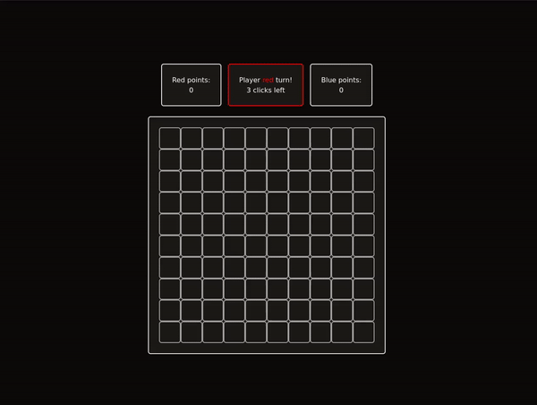

# Grafos1_BanzaiGame

_Número da lista:_ 45
_Conteúdo da disciplina:_ Grafos 1

## Vídeo da Entrega

Link no [YouTube](https://www.youtube.com/watch?v=ta9wZu-m77w&ab_channel=CaioFelipe)

## Alunos

| Matrícula  | Aluno                       |
| ---------- | --------------------------- |
| 21/1039484 | Iago Rocha Santos Marques   |
| 22/1007920 | Caio Felipe Rocha Rodrigues |

## Sobre

Neste projeto de Grafos 1 implementamos um jogo multiplayer (2 jogadores) local onde os dois players se revezam em turnos para colorir uma matriz. No início de cada turno, o jogador recebe uma quantidade aleatória de movimentos que deve ser usado para colorir uma célula da matriz ainda não preenchida. Toda vez que um jogador fecha uma área com sua cor, todas as células não coloridas contidas nessa área são coloridas com sua respectiva cor.

O projeto foi fortemente inspirado no minigame "banzai" do Habbo Hotel.

## Screenshot

Exemplo de partida:



## Uso

Com o Node instalado e estando na raiz do projeto execute:

```sh
npx http-server ./src/
```

Acesse o endereço e porta fornecidos e divirta-se!

## Executando em modo de desenvolvimento

### Habilitando o Tailwind

Certifique-se de possuir o Tailwind instalado de acordo com a [documentação](https://tailwindcss.com/docs/installation).

Depois execute o comando abaixo para gerar o CSS a medida em que o código fonte for alterado.

```sh
npx tailwindcss -i ./src/style.css -o ./src/output.css --watch
```
